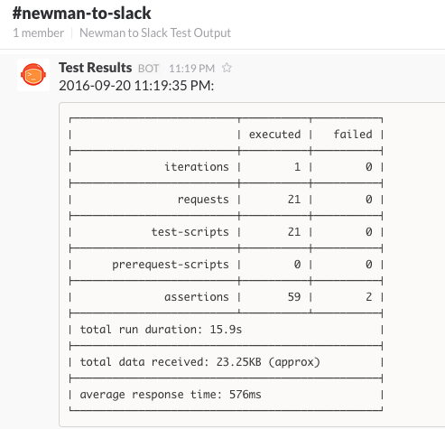

# Newman to Slack
Runs a Newman test script and outputs the summary to a Slack webhook 

[](https://travis-ci.org/cameronoxley/Newman-to-Slack)

##Getting Started

1. [Install Newman](https://github.com/postmanlabs/newman): ```$ npm install -g newman``` (Requires [Node](https://nodejs.org/en/download/package-manager/))
2. [Create a new Slack incoming webhook](https://my.slack.com/services/new/incoming-webhook/) and copy your webhook URL
3. [Download the latest release](https://github.com/cameronoxley/Newman-to-Slack/releases) of Newman to Slack
4. Run `$ ./Newman-to-Slack.sh`

Thats it!

###Usage

```bash
Newman-to-Slack.sh -- Runs a Newman test script and outputs the summary to a Slack webhook

    Options:
        -h, --help                        Show this help text
        -c, --collection      [arg]       URL or path to a Postman Collection
        -f, --config          [file]      Run a bash configuration environment (overwrites passed args)
        -e, --environment     [file]      Postman Environment to reference
        -w, --webhook         [url]       Slack Webhook URL
        -g, --global          [file]      Postman Global Environment
        -a, --additional      [command]   Additional Newman command
        -v, --verbose         [-v -v]     Verbose (add more -v for increased verbosity)
        -V, --version                     Version

    Where: -c [arg] and -w [url] is required
```

###Examples

######Run a collection and post the summary to a Slack channel

```bash
$ ./Newman-to-Slack.sh -c mycollection.json.postman_collection -w https://hooks.slack.com/services/url
```



## Newman v3.1+

The latest version of Newman is required to run Newman-to-Slack.

See the [migration guide](https://github.com/postmanlabs/newman/blob/develop/MIGRATION.md) for more information.
